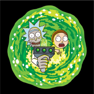

<!-- PROJECT LOGO -->
 

  

  <h3 align="center">FluRaM</h3>

  

    An app that show the characters list of the TV Animated Series Rick & Morty
  

<!-- TABLE OF CONTENTS -->

  
Table of Contents

    <ul>
        <li><a href="#built-with">Built With</a></li>
    </ul>

<!-- [![Main Screen][product-screenshot]](https://rickandmortyapi.com) -->

### Built With
- ![Flutter][Flutter]
- ![RiverPod][RiverPod]
- ![Freezed][Freezed]
- ![Dio][Dio]
- ![Dart][Dart]
  

<a href="#readme-top">Back to top</a>

<!-- MARKDOWN LINKS & IMAGES -->
<!-- https://www.markdownguide.org/basic-syntax/#reference-style-links -->
[product-screenshot]: product_screenshot.png
[Flutter]: https://img.shields.io/badge/Flutter-%2302569B.svg?style=for-the-badge&logo=Flutter&logoColor=white
[Freezed]: https://img.shields.io/pub/v/freezed.svg
[RiverPod]: https://img.shields.io/pub/v/riverpod.svg?label=riverpod&color=blue
[Dio]: https://img.shields.io/pub/v/dio.svg?label=dev&include_prereleases
[Dart]: https://img.shields.io/badge/dart-%230175C2.svg?style=for-the-badge&logo=dart&logoColor=white
